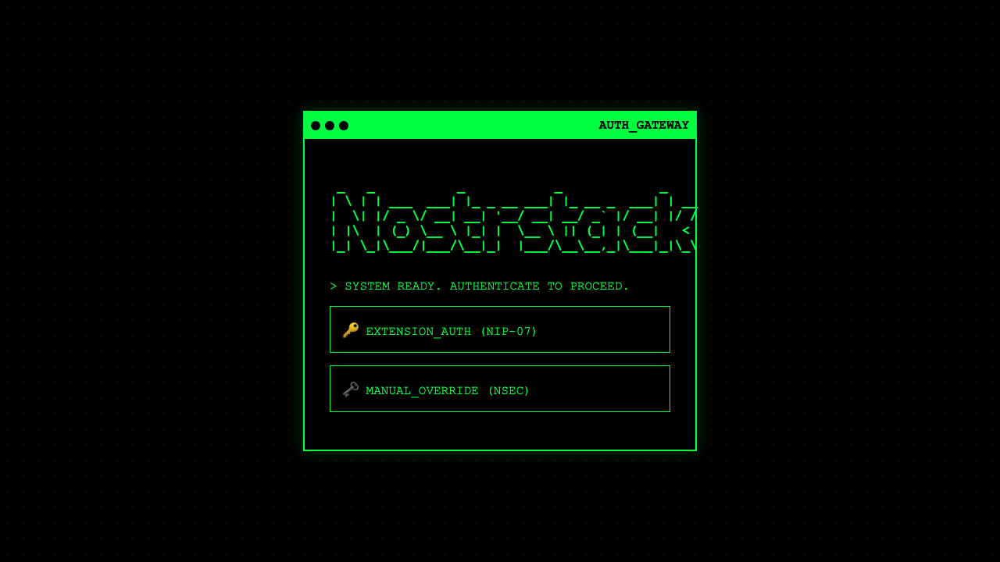
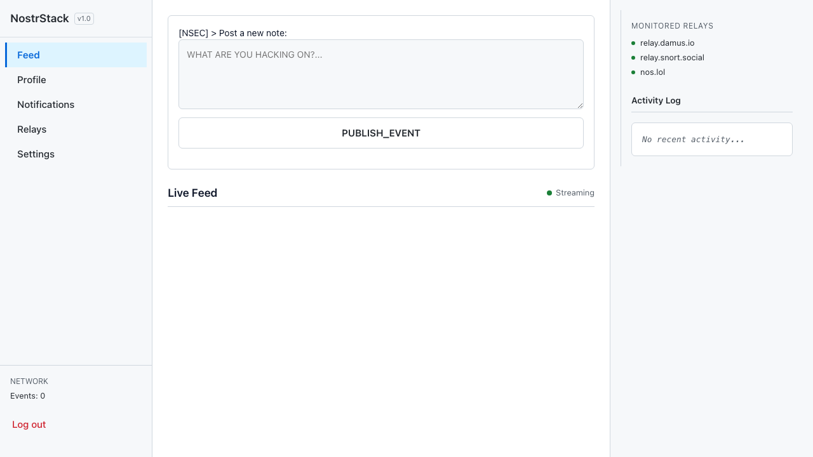
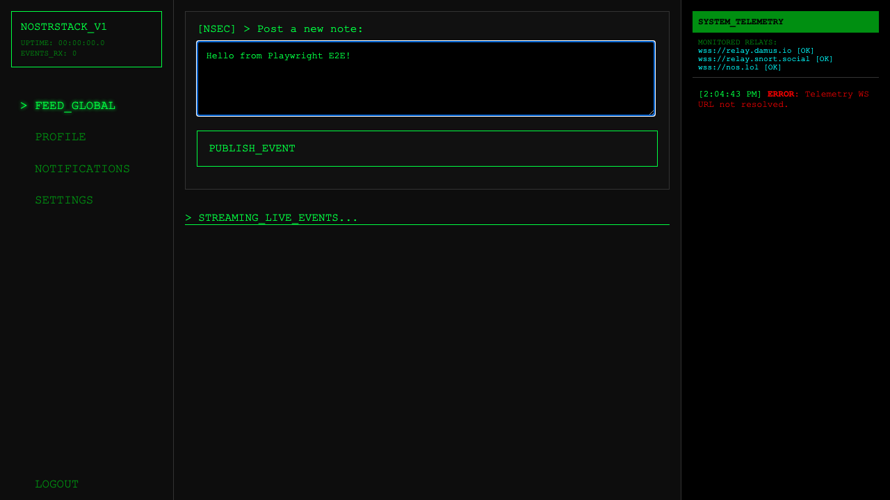
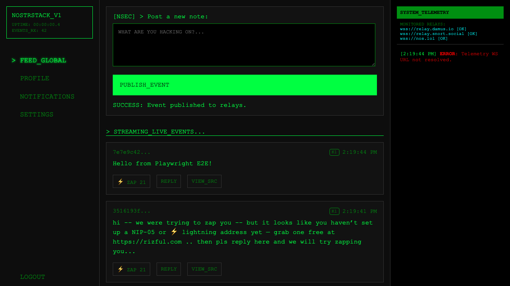
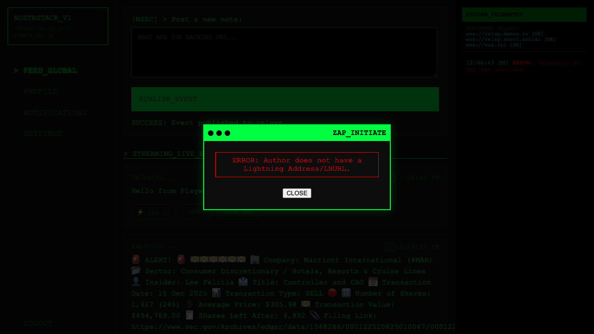
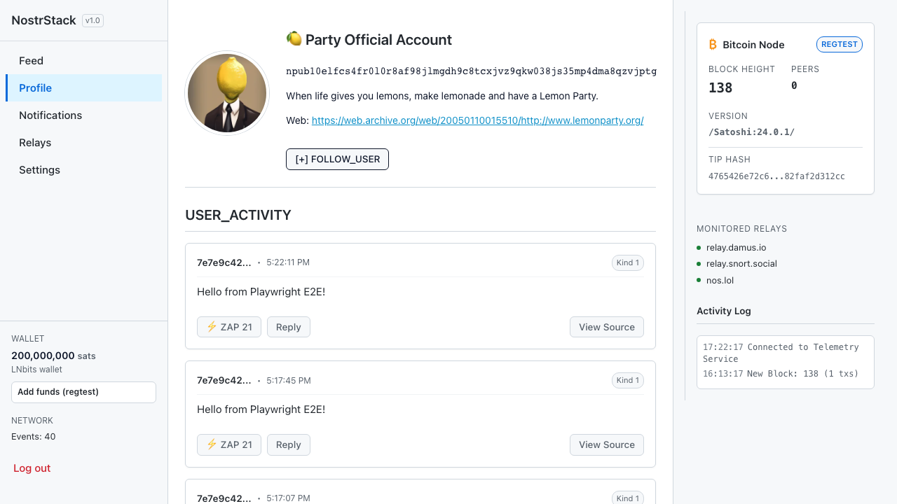

# NostrStack Social Network (Gallery)

A "Nerd Hacker" aesthetic social network client built on Nostr and Lightning, serving as the flagship implementation of the NostrStack SDK.

## Features

- **Auth**: NIP-07 (Browser Extension) and Encrypted Local NSEC login.
- **Feed**: Real-time global feed (Kind 1) streamed from relays.
- **Social**: Post notes, view user profiles (metadata + history).
- **Lightning**:
  - **Zaps**: NIP-57 one-click zaps via WebLN or QR code.
  - **Paywall**: L402-style paywalled content unlockable via Lightning.
- **Telemetry**: Real-time system monitoring and debug logs.

## Development

### Prerequisites

- Node.js 20+
- PNPM 9+

### Run Locally

```bash
pnpm dev
```

Runs at `http://localhost:4173`. Connects to `http://localhost:3001` (API) by default.

### Build

```bash
pnpm build
```

Artifacts output to `dist/`.

## Testing

### E2E (Playwright)

Run the full social flow test suite:

```bash
pnpm exec playwright test tests/social-flow.spec.ts
```

## Configuration

- `VITE_API_BASE_URL`: URL of the NostrStack API (default: `http://localhost:3001`).
- `VITE_NOSTRSTACK_HOST`: Hostname for display/logic (default: `localhost`).

## Visuals

These screenshots are generated by the E2E test suite. (CI uploads them as artifacts; update the `docs/screenshots/` copies when they change.)

### Login Screen



### Global Feed



### Posting Interface



### Post Result



### Lightning Zap



### User Profile


