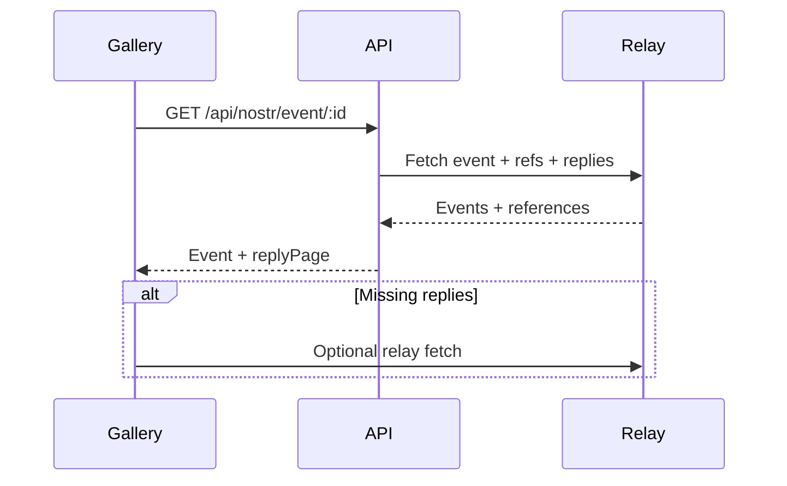

# Personal Site Kit architecture

## Goal
Provide a framework-ready set of widgets and APIs so a personal site can accept tips, host Nostr comments, share content to Nostr, render Nostr profile sections, and display live blockchain stats with strong performance and security defaults.

## Component map
- **API (apps/api)**: REST + WebSocket endpoints for tips, telemetry, identity, and Nostr event resolution.
- **Embed (@nostrstack/embed)**: script-tag widgets (tip, comments, share, profile, blockchain stats) with auto-mount data attributes.
- **Blog-kit (@nostrstack/blog-kit)**: React wrappers (SupportSection, profile, share, comments, tip feed, blockchain stats).
- **SDK (@nostrstack/sdk)**: typed client for REST endpoints (telemetry summary, Nostr event/identity).
- **Injector (packages/injector)**: static-site injection for script tags and widget placeholders.
- **Gallery (apps/gallery)**: demo and QA surface for the widgets.

## Data flow overview
### Tips
Browser widget -> API /api/pay -> Lightning provider invoice -> user pays -> provider webhook -> API updates payment -> widgets poll or subscribe to ws/tips for live feed.

### Comments
Browser widget -> direct relay subscriptions for thread tag -> NIP-07 signer posts event -> relays publish -> widget renders new event.

### Event landing (/nostr/:id)
Gallery -> /api/nostr/event/:id (resolve target + references + replies page) -> render event + replies -> optional relay fallback for missing replies.

Mermaid sketch:


### Share to Nostr
Browser widget -> NIP-07 signer signs kind 1 note -> relay publish -> widget updates status. Fallback to navigator.share/clipboard if signer unavailable.

### Profile section
Browser widget -> /api/nostr/identity (nip05) -> /api/nostr/event/:id (profile event) -> render profile card.

### Blockchain stats
Browser widget -> ws/telemetry for live blocks -> fallback to /api/telemetry/summary for initial or blocked WS.

## Configuration schema
Use a single config for site-wide defaults and per-widget overrides. In React, this maps to NostrstackProvider props. In script-tag usage, this maps to data attributes.

TypeScript sketch:
```
export type PersonalSiteKitConfig = {
  apiBase?: string;        // e.g. https://api.example.com
  host?: string;           // tenant host for embed-config
  relays?: string[];       // default relay list for comments/share
  lnAddress?: string;      // tip target for SupportSection
  theme?: {
    mode?: 'light' | 'dark';
    preset?: string;       // embed preset
    vars?: Record<string, string>; // --nostrstack-* overrides
  };
  tips?: {
    itemId?: string;
    presetAmountsSats?: number[];
    defaultAmountSats?: number;
  };
  comments?: {
    threadId?: string;
    maxItems?: number;
    maxAgeDays?: number;
  };
  share?: {
    url?: string;
    title?: string;
    tag?: string;          // defaults to nostrstack:<itemId>
  };
  profile?: {
    id?: string;           // npub | nprofile | nip05
  };
  blockchain?: {
    enabled?: boolean;
    wsUrl?: string;        // optional override
    httpUrl?: string;      // optional override
  };
};
```

Precedence:
1) Per-widget props/data attributes.
2) Site-wide config (NostrstackProvider or injected defaults).
3) Built-in defaults (relays, theme, polling intervals).

## Styling and isolation strategy
- Widgets are namespaced with `.nostrstack-*` classes and use CSS variables under `.nostrstack-theme`.
- No Shadow DOM is used; host sites should avoid global resets that override `.nostrstack-*` classes.
- Prefer wrapping widgets in a `.nostrstack-theme` container and overriding `--nostrstack-*` vars rather than custom CSS.

## Privacy and security
- Telemetry data is blockchain-only (block height, mempool counts). No visitor analytics or cookies.
- Nostr content is public and rendered as text only; signatures are validated when possible.
- Relay URLs are validated (wss:// only, ws://localhost in dev) and capped for safety.
- NIP-07 signing stays in the user browser; no private keys are sent to the API.

## CSP / CORS guidance
- **script-src** must allow the embed CDN (e.g. https://unpkg.com) if using script tags.
- **connect-src** must allow:
  - API base URL (https://api.example.com)
  - WebSocket endpoints (wss://api.example.com/ws/telemetry, wss://api.example.com/ws/tips)
  - Nostr relays (wss://relay.example)
- Avoid wildcard CSP sources and permissive CORS (`*`) for authenticated resources; prefer explicit allowlists.
- If CSP blocks WS, widgets fall back to HTTP polling and show a stale state.
- API CORS should allow your personal site origin(s) to access embed-config and telemetry summary.

## Assumptions and limits
- Relay caps and timeouts are enforced server-side and client-side to avoid rate limiting.
- Large comment threads are paginated; UI uses "Load more" for older events.
- Multiple widgets can coexist; use unique itemId/threadId per page to avoid cross-talk.
